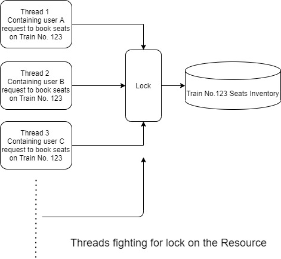
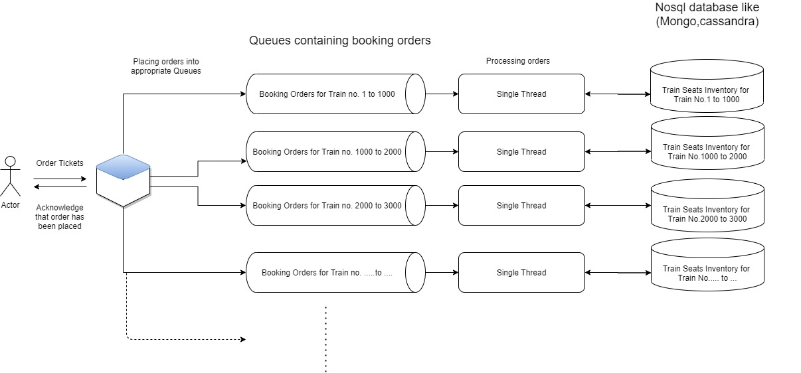
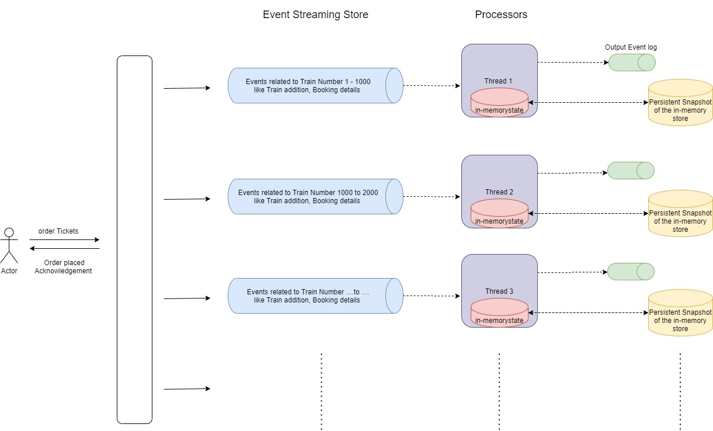
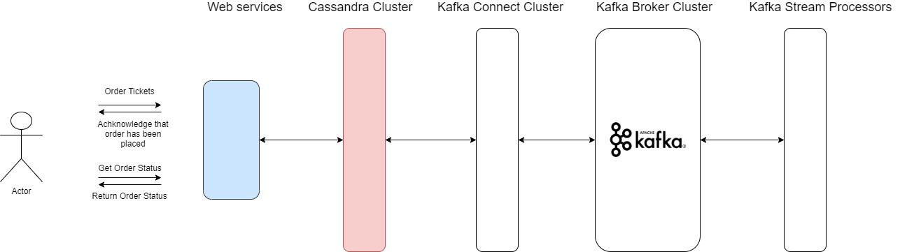

# Highly scalable IRCTC Tatkal Booking System

This project is a prototype for IRCTC Tatkal Booking System.

## Background

[IRCTC](https://en.wikipedia.org/wiki/Indian_Railway_Catering_and_Tourism_Corporation) is a subsidiary of the Indian Railways 
that handles the catering, tourism and online ticketing operations, with around 5,50,000 to 6,00,000 bookings every day.
IRCTC has more than 20 million user database and more than 12,000 trains running per day.
Indian railways have Tatkal Ticket booking scheme where certain number of the train seats can only be booked on the day prior to train departure.
'Tatkal' is a hindi word for 'Immediate'. This is handled on online by https://www.irctc.co.in .
This Tatkal scheme is used for booking journeys at very short notice.

As of now year 2020 the irctc website allows tatkal booking for sleeper coaches(compartments) from 11:00 A.M IST.
As result many people across the country who wants to travel by train on short notice would try booking tickets on 11:00 A.M IST.
This leads to tremendous high load on the irctc system which could result in poor response time, 
high latency for ticket booking orders and in the worst case that the system could crash.

Irctc tatkal booking system is a perfect use case for highly scalable system.
I got fascinated about how one would design and implement such a system that is highly scalable, reliable,
maintainable and can process ticket booking requests with low latency.
So, I took this as a challenge to solve.
During this challenge I learnt many interesting things and came across interesting ideas on building highly scalable systems.

The goal is to design and build the system that should be highly scalable, reliable and should process many ticket booking orders with low latency.

## Approach

A naive approach is to maintain the data in a RDBMS and have services built on it. These services would process the ticket booking
requests following synchronous request-response workflow and leveraging transactional capabilities of RDBMS.
But the problem with this approach is that its not scalable. Though you can scale up the services, but the RDBMS remains the bottleneck for the entire architecture.  
Another approach is to use horizontally scalable Nosql databases instead of RDBMS.
But you would lose ACID properties provided by the RDBMS. However, the problem with the above two approaches is that it would 
involve locking of resources because of processing the ticket booking orders concurrently and this would create a huge bottleneck.
This is the architecture that a beginner would follow and ends up learning that this architecture would not perform in high workloads (assuming beginner would do performance testing).

So, there are couple things we should ponder on? What if we don't process orders concurrently and opt for asynchronous workflows.
This is where things will get interesting. Processing ticket booking orders by a single thread sequentially involving same train number would require no lock on the resources.
This is something the architecture would look like and one designing would end up most probably ...

The above is the architecture that one would end up most probably, at least I have ended up with the above architecture.
The above architecture is highly scalable. Increase the number of queues, processing threads and partitions of your database
to achieve high scalability. But the other goal that the system should process ticket booking orders with low latency, kept me nagging.
While I was implementing this architecture,
I was also working on kafka (distributed event streaming platform) and event-driven architectures and I came across this 
article called [LMAX Architecture](https://martinfowler.com/articles/lmax.html) written by Martin Fowler.
This article provided more answers for my nagging thought about low latency. In fact, I would recommend you to read the article 
which describes how LMAX company is able to process 6 million transactions per second.
The most important principles they followed is processing orders sequentially and operating entirely in-memory, there is no persistent store.
Operating sequentially entirely in-memory has many advantages like there is no for object-relational/object-document mapping,
there are no IO calls that could slow down the processing and no transactional behaviour and locks required  since all the 
processing is done sequentially. But keeping things in-memory has some serious consequences of what if everything 
crashes/power cuts? The answer lies in Event Sourcing. Modeling things as events and storing them in a durable persistent store 
allows us to construct in-memory state by replaying the input events. We can also expedite the process of 
constructing in-memory state by capturing the snapshot of in-memory state while processing at regular intervals and 
replaying the events occuring after the snapshot.

The [previous architecture](#firstArchitecture) has threads interacting with persistent stores continuously for almost every booking order.
This network IO calls could be reduced by maintaining in-memory store and modeling everything in the architecture as events.
This allows processing orders with low latency. So the revised abstract architecture I ended up is something like this below...

The above architecture is very much abstract and doesn't go into the details of its implementation. Nonetheless, the architecture
is highly scalable and processes ticket booking orders with low latency provided that appropriate tools and technologies are 
being used to implement the architecture.

## Implementation

My implementation looks like this, but this is not the final draft ...

The project is still in progress ....